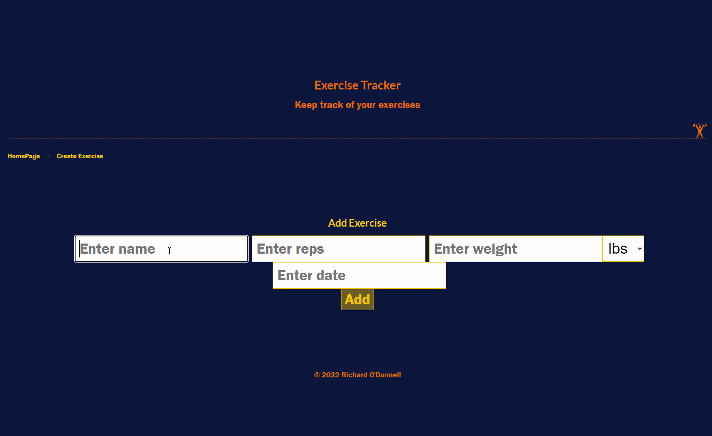

# BurgerBuilder for Android

**Full Stack MERN App** This is the portoflio project for a full stack web development course I took at university. It uses the MERN stack to host a Single Page Application (SPA) that tracks exercises completed by the user. It has React for the front-end UI app. There is also a REST API using Node and Express for the back-end web service. It uses MongoDB for persistence.

## Video Walkthrough

GIF created with [LiceCap](http://www.cockos.com/licecap/).
